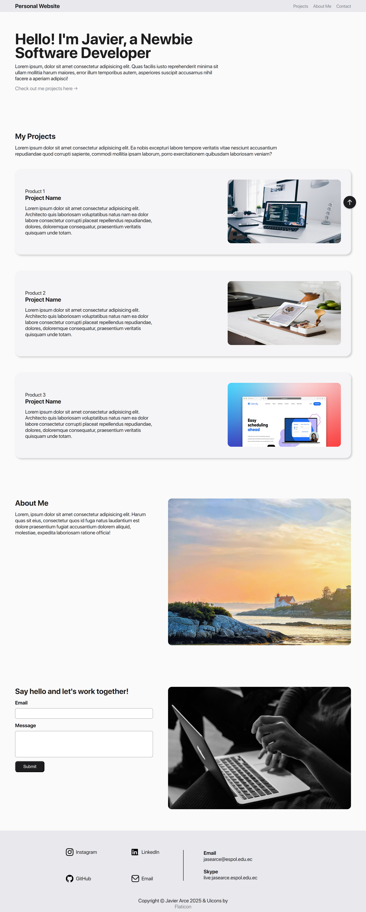

# Project 1: Personal Portfolio Landing Page

## Description

The main goal of this repo is to create a simple, single-page portfolio to showcase who you are and what you’re learning. This is a great way to practice structuring content with HTML and styling it with Flexbox.

## Guidance

For guidance this project follows these instructions:

### HTML Structure:

- Use a `<header>` for your name and a tagline (e.g., "Aspiring Web Developer").
- Add a `<main>` section with two parts: an "About Me" section and a "Contact" section.
- Include a `<footer>` with fake contact info (e.g., email, social media handles).
- Use [this website](https://www.visily.ai/templates/personal-website-wireframe/) for reference.

### Flexbox Styling:

- Make the `<header>` a flex container to align your name and tagline side by side or stacked neatly.
- In the `<main>` section, use Flexbox to create a row or column layout for the "About Me" and "Contact" sections. For "Contact," display a form (with an Email and Message) in a vertical flex container.
- Use Flexbox properties like justify-content and align-items to center or space out content.
- Style the `<footer>` as a flex container to evenly space the contact details.

## Final Result
